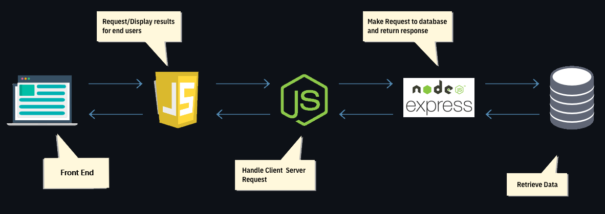

# Login page with MongoDB as data base and ExpressJS as API framework

This repository provides a template for creating web app with login credentials of users made using [MongoDB][1] & [Express][2] an [NodeJS][3] web framework.

This Login Page uses Express API as communication channel with data base

## Pictorial Representation

## Getting Started

Firstly, go to src folder

    cd public/src

Initialize node

    npm init -y

Install Express, mongoose, cors, body-parser

    npm i express mongoose cors body-parse --save

Run file named `dbConn.js` in src folder

    node ./dbConn.js

come to root directory and start live server make sure to use `http://localhost:port` instead `http://127.0.0.1:port` which may cause CORS error

## API Endpoints
> 1. `http://localhost:3000/users`
>>   Method: get 
>>   Description: Get All Users
> 2. `http://localhost:3000/users`
>>    Method: post 
>>    Description: Create user entry in DB
> 3. `http://localhost:3000/user/:query`
>>    Method: get 
>>    Description: Get Specific user from DB
> 4. `http://localhost:3000/users/:key`
>>    Method: patch 
>>    Description: Update a user
> 5. `http://localhost:3000/users`
>>    Method: delete 
>>    Description: Delete User from DB {request is stored in body}
> 6. `http://localhost:3000/verify/:EmailQuery`
>>    Method: get 
>>    Description: Get Email and Password from DB
> 7. `http://localhost:3000/getEmail/:EmailQuery` 
>>    Method: get 
>>    Description: Get if Email is Valid or not
> 8. `http://localhost:3000/setpass/`
>>    Method: patch 
>>    Description: Update Password for User Email sent form body of request

## Using This Template In GitHub Pages

Currently this template is NOT configured to work on GitHub pages. The easiest way to use this template is by cloning this repo and using it as a starting point for your own project. 

### Cloning this repository from the Command Line
* If you have enabled two-factor authentication (GSA requirement) you will need to [create an access token for the command line](https://help.github.com/articles/creating-an-access-token-for-command-line-use/). (Save the token and use in next step.)
* Then follow instructions for [duplicating the repository](https://help.github.com/articles/duplicating-a-repository/). Use the token you generated in place of the password.

### Cloning this repository from the Github web interface
* From your github home page, select "[start a project](https://github.com/new)" or "[new repository](https://github.com/new)".
* Create this repository in the GSA organization.
* Enter the appropriate information for the new repository you are creating. Do not select "initialize this repository with readme".
* On the next page, select "import code from another repository".
* The next page is titled "Import Your Project To Github". In the box below "Your old repository’s clone URL", enter the source URL for this repository (listed above). Click "begin import".
* When the import is completed, you should see the "import complete" message.

### Making the cloned repository your own

* Modify the readme.md in the master branch with the name and details of your own documentation.
* In the repository settings, make this repository public. (Keep in mind you won't be able to put sensitive information in it.)
* Enable the GitHub pages web site by going to "Settings". In the "GitHub Pages" section, select "Master Branch /docs folder" and click the save button.
* GitHub will display a URL to your documentation web site. You will need to add "api-docs/" to this path to access the web site.
* You can add the link to this web page on the "code" tab of your repository (see this repo for an example). Go to the "code" tab of your repository, and click the "edit" button toward the top of the page. Enter the URL to your documentation (remember to add "api-docs/") in the "website" box, and add your own description in the "Description" box. Click save. You should see the link at the top of the "code" tab.

## Helping me improve
Please feel free to add issues and pull requests for any recommendations you think would be worthwhile for all users of the template.

[1]: https://github.com/onedrive/markdown-scanner
[2]: https://expressjs.com/
[3]: https://nodejs.org/en/docs/